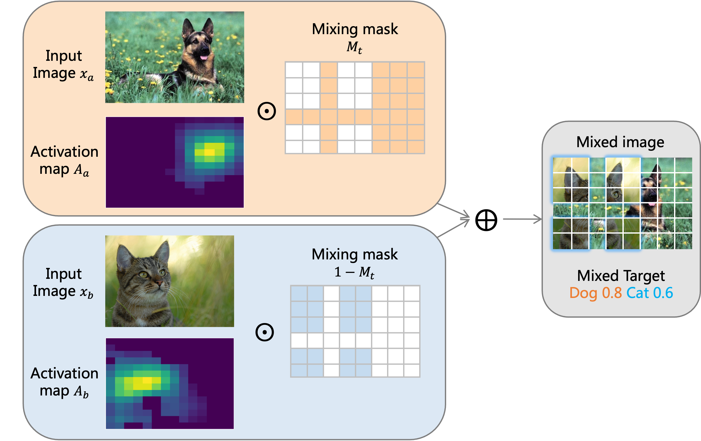

## Pytorch implementation of [TokenMix (ECCV 2022)](https://arxiv.org/abs/2207.05420)



This repo is the offcial implementation of the paper [TokenMix: Rethinking Image Mixing for Data Augmentation in Vision Transformers](https://arxiv.org/abs/2207.05420)

```
@article{UniNet,
  author  = {Jihao Liu, Boxiao Liu, Hang Zhou, Yu Liu, Hongsheng Li},
  journal = {arXiv},
  title   = {TokenMix: Rethinking Image Mixing for Data Augmentation in Vision Transformers},
  year    = {2022},
}
```